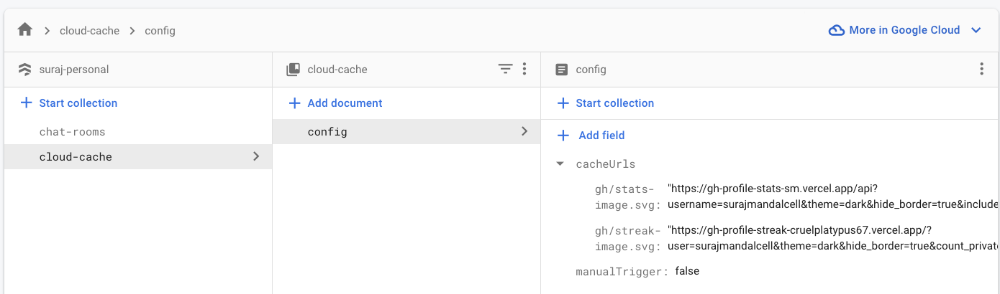

# Cloud Cache

## Description

This is a simple cache setup which solves my initial problem^[1] mentioned below. This cloud function pushes a copy of the image/data from firestore and pushes it to firebase storage. The cloud function runs on a cron job which is scheduled to run every 2 hour.

#### The Problem $^{[1]}$

I use DenverCoder1's github-readme-streak-stats & anuraghazra's popular github-readme-stats both of which are hosted on vercel and generate the image on the fly.  
Since the images are generated everytime someone requests for them they either take a lot of time to load or just straight up dont load, to be more presise it mostly happens during vercel functions cold start.  
This is where this cloud function comes in. It caches the image and pushes it to firebase storage. The image is then served from firebase storage.

## Usage

To use this cloud cache setup, you'll need to follow these steps:

1. Create a `cloud-cache` collection in your Firebase Firestore database.
2. Create a `config` document in the `cloud-cache` collection with the following fields:

   - `cacheUrls`: a map of file names and URLs to cache.
   - `manualTrigger`: a boolean that can be used to trigger the cache manually.

3. Deploy the cloud function to Firebase using the `firebase deploy` command.
4. The cloud function will run on a cron job that is scheduled to run every x hours(or your desired time). Alternatively, you can manually trigger the cache by setting the `manualTrigger` field to `true` in the `config` document.

#### Features

- Pubsub cache periodic trigger
- Manual cache trigger
- Cache to firebase storage
- Cache to specific folder

## Deploy

In firebase firestore create the following

```
- cloud-cache (collection)
  - config (document)
    - cacheUrls (type: map)
      - "file1.txt": "https://example.com/file1.txt"
      - "foldera/file2.txt": "https://example.com/file2.txt"
    - manualTrigger (boolean)
```

The structure should look like this


Then run the following commands

```bash
# Install firebase cli
npm install -g firebase-tools

# Install dependencies
cd functions
npm install
cd ..

# Login to firebase
firebase login

# Init firebase
firebase init

# Deploy
firebase deploy
```

## Additional Notes

- You can mention the file path in the `cacheUrls` map to cache the file in a specific folder.(example: `foldera/file2.txt` will cache the file in `foldera` folder in firebase storage)

- You can manually trigger the cache by setting the `manualTrigger` field to `true` in the `config` document. It will

## Author

- [Suraj Mandal](https://github.com/surajmandalcell)

## License

[MIT](https://choosealicense.com/licenses/mit/)
